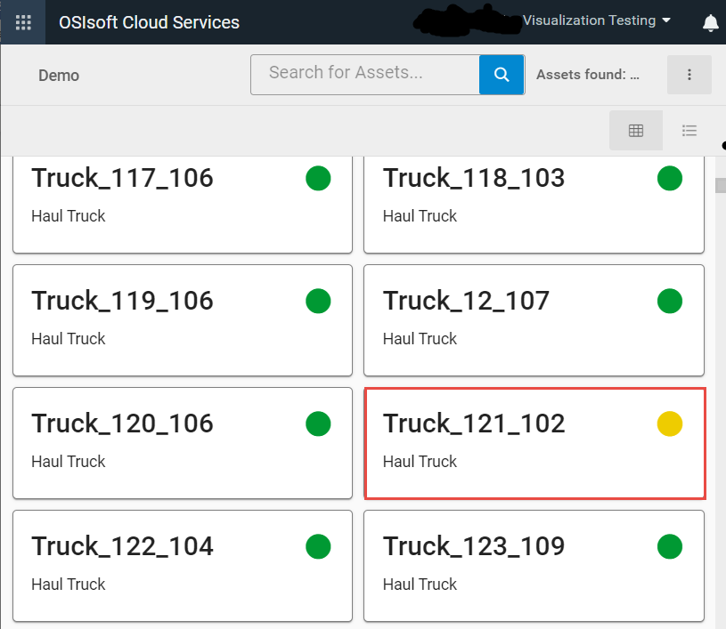

Getting Started with Remote Operations Monitoring
=================================================

OSIsoft Cloud Services (OCS) makes it possible to monitor remote assets in real
time. The immediate access to data about the status of assets gives you the
ability to anticipate problems and proactively perform preventative maintenance.

For example, a fleet manager of a mining truck dealer sells trucks to companies
worldwide. His company provides monitoring and maintenance services to their
customers. With remote monitoring, he reviews the status of the trucks each day,
identifies trucks with problems, uses the data collected on different
measurements to identify possible causes, reviews the history of these
measurements over time, and shares the information with colleagues in the field
who can follow up on the problem.

I copied my image file to ..\Documentation\images\copy_url_link.png. And I'm referencing it here.

The following procedure describes how you use the OCS visualization tools to
perform remote operations monitoring.

Procedure
---------

1.  Log in to OSIsoft Cloud Services.

2.  Click the navigation icon

    Copy URL

    and click **Asset Explorer** (under Visualization). The Asset Explorer
    displays the defined assets.

>   Note: Click on the icons to toggle between the card and table views of the
>   assets.

~~~~~~~~~~~~~~~~~~~~~~~~~~~~~~~~~~~~~~~~~~~~~~~~~~~~~~~~~~~~~~~~~~~~~~~~~~~~~~~~

~~~~~~~~~~~~~~~~~~~~~~~~~~~~~~~~~~~~~~~~~~~~~~~~~~~~~~~~~~~~~~~~~~~~~~~~~~~~~~~~

>   A picture containing clock Description automatically generated

1.  Scan through the assets and identify any assets with a yellow or red dot.

>   A yellow dot indicates ...

>   Note: Use the Search box to filter the list of assets displayed.

~~~~~~~~~~~~~~~~~~~~~~~~~~~~~~~~~~~~~~~~~~~~~~~~~~~~~~~~~~~~~~~~~~~~~~~~~~~~~~~~

~~~~~~~~~~~~~~~~~~~~~~~~~~~~~~~~~~~~~~~~~~~~~~~~~~~~~~~~~~~~~~~~~~~~~~~~~~~~~~~~

>   A screenshot of a cell phone Description automatically generated

1.  Click on the asset to open the Asset Details pane and display the asset’s
    attributes.

>   Attributes are metadata associated with the asset.

>   A screenshot of a cell phone Description automatically generated

1.  Click the **Measurements** tab.

>   The Asset Details pane displays the following:

-   Data associated with the asset. These values are updated in real time.

-   A trend of the selected measurements.

>   A screenshot of a cell phone Description automatically generated

1.  Select one or more of the measurements which you think might be the cause
    for the warning.

2.  Review the history of the selected measurements in the trend to see if the
    data suggests you have identified a potential cause. The trend shows the
    measurements for the last 8-hour period.

3.  Click the **View full trend** icon

-   to see the Trend page.

A screenshot of a cell phone Description automatically generated

A screenshot of a cell phone Description automatically generated

>   Note the following:

-   The Trend page shows the measurements for the same 8-hour time range.

-   There are three views of the trend:

    -   Stacked mode – Each trend is displayed in its own trend.

    -   Single-scale mode – All measurements are plotted on the same scale.

    -   Multi-scale mode – All measurements are plotted on its own scale.

>   Click on the

>   icon to toggle through the views.

-   The Legend table shows the statistics for each trace.

1.  Click on a trace to select it.

>   The trace is highlighted, and two cursors automatically mark the minimum and
>   maximum values for the displayed time range.

>   A picture containing row, many, bunch, group Description automatically
>   generated

>   Click the plus sign (+) above the trace to lock the cursor in place. The “+”
>   turns into an “x.” Click the “x” to unlock the cursor.

1.  Click **Step backward** to move the time range 8 hours back or **Step
    forward** to move it 8 hours forward.

>   A screenshot of a cell phone Description automatically generated

1.  Click the link

-   in the menu bar to copy the URL of the workspace.

>   You can share it in an email with a colleague as necessary.

